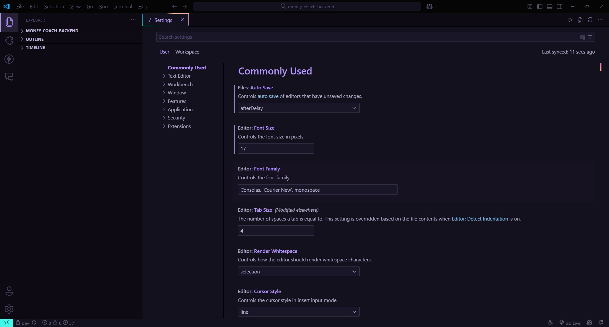

# Customize VSCode

## Preview

### Border Gradient Spinner

## Instructions

1. **Install Required Extension**  
   Install the extension [Custom CSS and JS Loader](https://marketplace.visualstudio.com/items?itemName=be5invis.vscode-custom-css) from the VSCode Marketplace.

2. **Set Up Customizations**  
   - Copy the provided CSS file (`style_vscode.css`) and link it through your `settings.json` as required by the extension.
   - Add any additional JavaScript or animations (e.g., `updateHandler.js`) for advanced effects.

3. **Suggested Settings**  
   To fully enjoy the theme and animation effects, consider the following customizations in your `settings.json`:
   - Enable smooth scrolling, cursor animations, and power mode.
   - Configure a preferred theme like "Bearded Theme feat. Will" or "Dracula".
   - Set up Prettier as the default formatter for a consistent coding experience.

   For detailed examples, refer to the `settings.json` file in this repository.

4. **Restart VSCode**  
   After applying the changes, restart VSCode to activate the custom theme and animations.

## Enjoy!  
Experience a vibrant, responsive, and personalized coding environment with these customizations.

---
For more details about advanced configurations, see the provided example `settings.json`.
